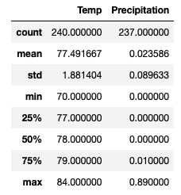
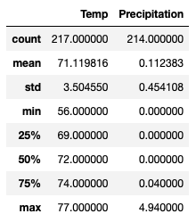
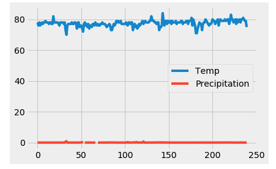
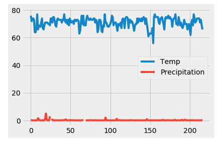

# Surf's Up!

This analysis shows that there are enough customers between seasons to sustain the business throughout the year. The analysis will:
* Determine key statistical data about the month of June.
* Determine key statistical data about the month of December.
* Compare findings between the month of June and December.
* Make recommendations for further analysis.

The findings of this analysis are shared below, as well as in the above Jupyter notebook.

## Key statistical data for the month of June

The weather data analysis for June shows that the average temperature is about 77F with relatively little precipitation. The standard deviation is not too large (1.88), indicating that the temperature does not vary too much in the summer months. The temperature in June is typically not below 70F, which shows that June is the perfect month for attracting traffic to a surf n’ shake shop.

## Key statistical data for the month of December

The weather data analysis for December shows that while the average temperature is about 71F, there is no significant difference in temperature as compared with June. Standard deviation in temperature is a little larger (3.5), which indicates that there are some swings in temperature in December. Precipitation data for December tells a more ‘dire’ story, as December tends to be a wet month (0.11mm average precipitation, with a maximum precipitation of 4.9mm). This may alter the decision of some to eat ice cream, however since December holidays tend to be peak travel time in Hawaii, the shop has a chance at attracting patrons in December. 

## Findings
### June

### December

Comparing the weather data between June and December, we can see that while June temperatures tend to be higher and fluctuate less, December weather is only marginally cooler. Seasonal effects of weather will be more related to precipitation, as December is a wetter month. This may alter surfer traffic, however since December tends to be peak tourist season, there may be a chance that the shop continues to attract visitors. By comparing data from June and December, we can reasonably conclude that the shop may attract more traffic in June as compared with December.

## Recommendations for further analysis

### 1)Expand the statistical analysis of weather conditions data to all months.
The simplest way to expand the scope of this analysis using existing data is to run the above analysis across fall and spring months in Oahu. Sustaining the business throughout the year will be a function of not only appealing to tourists in the area during peak months, but also by building a reputation among locals when surfing season does not have as many tourists.

### 2)Identify surfing hotspots by analyzing wave height data, over various seasons and around the island, to establish where in Oahu to open the surf/ice cream shop.
Analysing wave height data around the island could help us establish where in Oahu has the most surfing traffic. Since surfing is largely dependent on the quality (height) of waves, and surfers prefer to go where waves heights are larger, analyzing wave height data could give some insight into what locations in Oahu are most frequented by surfers. Based on this seasonal wave analysis, we can narrow down where to open up the shop so it has consistent traffic.

#### 2a)Combine seasonal wave height analysis with data regarding tourist hotspots.
To further strengthen wave height analysis, we can collect and create a database of tourist hotspots by gathering data on hotels and commercial centers, and cross-referencing those area names with the areas that are identified in the wave height analysis, and narrow down a list of locations for the ice cream shop. This would help us maximise traffic in peak seasons not only from surfers, but also from tourists who are not surfing.

### 3)Research and create a database of seasonal surfing competitions around Oahu.
Surfing culture is as much about the surfing as it is about its spectators. By researching data on surfing competitions that occur around Oahu, we can gain insight into which seasons will have traffic from professional surfers and spectators (both locals and tourists). This analysis would give us some very valuable insights into an important part of surfing culture: competitions. Surfing competitions typically happen between November and March, and these competitions attract locals, tourists, and other surfing professionals not taking part in the competitions. This seasonal data would be useful to build a strong case for opening up the surfboard and ice cream shop, and show that ice cream would be in demand year round!
